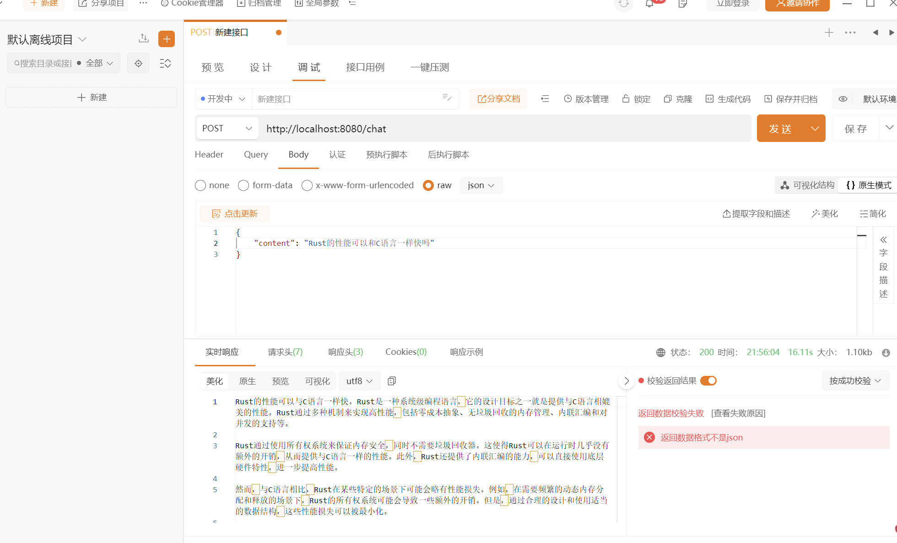

    

<h1 align="center">Rust-BaipiaoGPT</h1>

Free chatting with gpt-3.5-turbo.

## WebAssembly web page(In Progress)
~~~shell
cd webpage
trunk build --release
~~~
Open webpage to chat with AI. 

`WebAssembly` page has no backend server. 

So we can directly deploy it on `GitHub Pages`.

## Use core as http service
~~~shell
cd server
cargo build --release
~~~

### Features
* multi-platform
* chat with context
* dynamic port binding
* cross origin

### Usage

#### Run with default port: 
Default Port: 8080
~~~shell
# darwin/linux
./rust-baipiaogpt  # use your file name!!!!

# windows
rust-baipiaogpt.exe  # use your file name!!!!
~~~

#### Run with custom port: 
~~~shell
# darwin/linux
./rust-baipiaogpt 2333 # use your file name!!!!

# windows
rust-baipiaogpt.exe 2333 # use your file name!!!!
~~~

#### APIs

| URL               | Method   | Description                                              |     
| :---------------- | -------- | -------------------------------------------------------- |
| /chat             | post     | Return the response of AI, save contexts in an array     | 
| /clearContext     | get      | clear context                                            | 
| /showContextCount | get      | get count of current contexts                            | 
| /regenerate       | get      | remove latest question and answer, re-ask the latest question to get new answer | 

##### API Parameters
Only `/chat` has parameter:

you need to give a request body(json):

~~~typescript
{
    content: "your question"
}

// request example using axios
axios.post("/chat",{
   content: ""
}).then(...)
~~~

For any other API:
~~~typescript
axios.get("/xxx").then(...)
~~~

##### API Test
You can use `Postman` , `ApiPost` or any api debug tool to test the APIs

